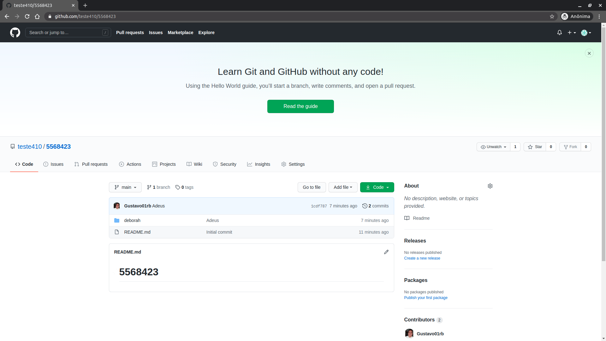
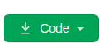
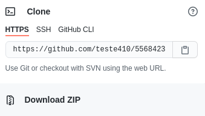

<h1>Tutorial para acessar o conteúdo</h1>

Se você abriu esse link provavelmente está na seguinte página:

  

Para baixar os conteúdos da página clique no botâo:

  

Ele irá te dar as seguintes opções:

  

Agora siga os seguintes passos:

<ul>
  <li>Vá em Download Zip</li>
  <li>Selecione o lugar que você quer baixar sua pasta</li>
  <li>Após baixar a pasta, abra-a</li>
  <li>Acesse o aqruivo com nome de index.html (só um duplo clique já vale)</li>
</ul>
